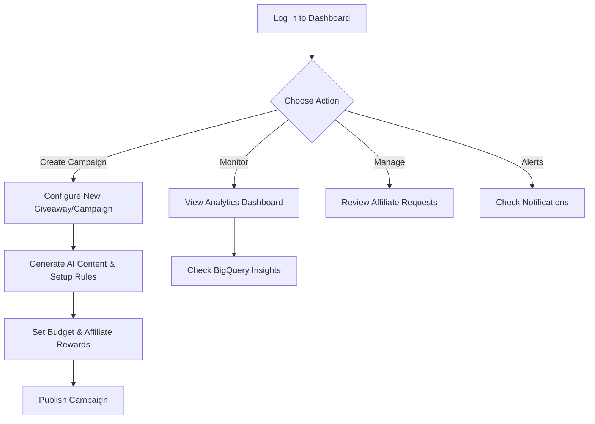
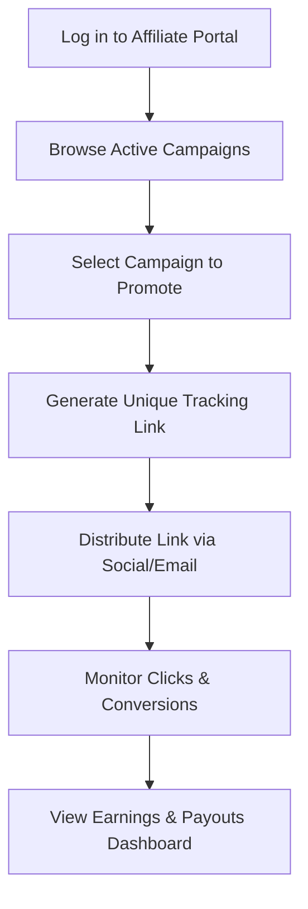
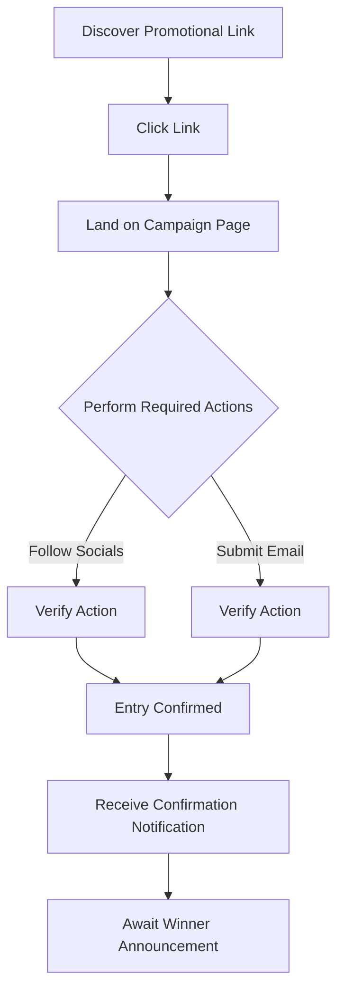

# User Stories & Flows

## Overview

**Agent Marketing** is a modern, comprehensive marketing platform designed to streamline campaign management, affiliate tracking, and giveaway execution. It empowers campaign managers to easily create and monitor promotional campaigns, provides affiliate operators with tools to generate links and track earnings, and ensures a seamless, engaging experience for giveaway participants. Behind the scenes, it leverages AI for content generation and BigQuery for robust analytics.

---

## User Flows

### 1. Campaign Manager Flow

The Campaign Manager is responsible for setting up, executing, and monitoring marketing campaigns and giveaways.

### 2. Affiliate Operator Flow

The Affiliate Operator participates in the platform to find campaigns, promote them using their specific links, and earn commissions based on performance.

### 3. Giveaway Participant Flow

The Giveaway Participant is the end-user who interacts with the promotional content and enters the giveaway.

